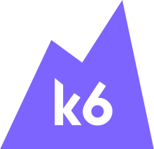

<p align="center"><a href="https://k6.io/"></a></p>

<h3 align="center">test-api.k6.io</h3>
<p align="center">Simple REST API project that is a good target for experimental load testing.</p>

<br/>

<br/>

It contains multiple authentication mechanisms, both private and public, as well as HTTP and websocket endpoints.

## Set up your local development environment

Using `docker-compose`:

```bash
docker-compose up -d
```

You should now be able to access it at http://localhost:8000/

By default, the data is stored in a local `SQLite` database.


### Using `python` and `pip`

Alternatively, you can set up the project using `python` and `pip`: 

```sh
cd test-api.k6.io
python3 -m venv .venv
source .venv/bin/activate
pip install -r requirements.txt
```

You will likely need to install some dependencies not installed in your system. For example:

```sh
sudo apt install libmysqlclient-dev  # debian/ubuntu
pip install wheel
```

Once you have set up all the project dependencies, configure the database:

```sh
python project/manage.py makemigrations && python project/manage.py migrate
```

Load fixture with initial data to populate the database with some users and crocodiles:

```sh
./devops/loaddata.sh
```

Run django server:

```sh
ENVIRONMENT_NAME=dev python project/manage.py runserver
```

You should now be able to access it at http://localhost:8000.


## Browseable API

Nice feature of this project is that APIs are "browseable", and can be easily explored by developers via the web interface.

Explore this by clicking on one of the endpoints, for example [/public/crocodiles/](http://test-api.k6.io/public/crocodiles) and login (top right corner) with one of the default users.
